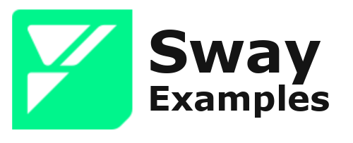

    <picture>
        <source media="(prefers-color-scheme: dark)" srcset="public/sway-examples-logo-dark-theme.png">
        
    </picture>

    
    
    
    
    

## Overview

This repository is designed to showcase full-stack examples of the Sway Language that users can reference. 

All examples are maintained by official Sway contributors and will be kept up to date with the latest working version of the Fuel development stack. Each application includes a functional Sway program, a frontend using Typescript, and tests written in Rust, all with the help of the SDKs.

## Examples

#### [NFT Launcher](./nft/README.md)

- An example demonstrating how to mint and burn native NFTs with images stored on IPFS.
- [demo](https://fuellabs.github.io/sway-examples/nft/)

#### Token Airdrop

- Learn how to work with merkle trees in Sway to distrubute native tokens across multiple addresses.

#### [Counter Dapp](./counter/README.md)

- A simple example to demonstrate basic functionality.
- [demo](https://fuellabs.github.io/sway-examples/counter/)

## Coming Soon

- SwayFarm
- Predicate-based Orderbook
- Voting DAO
- Constant Product AMM

## Using an Example

Go to the directory or click the example in which you want to explore. Follow the instructions in the README.md file to install, build, and deploy the example application. This repository is intended to be an up-to-date resource on various blockchain building topics from minting and burning to using merkle trees.

## Contributing

Please refer to the Fuel Labs contribution guidelines. For new example requests, please open an issue.
